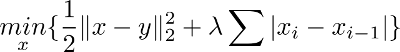

Total variation denoising
==========================================================

Solver for standard 1-D total variation denoising problem:

The algorithm is exact up to floating point error and run in
worst-case linear time in the input size. 

Reference: <https://en.wikipedia.org/wiki/Total_variation_denoising>

